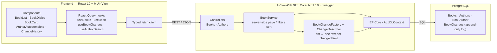
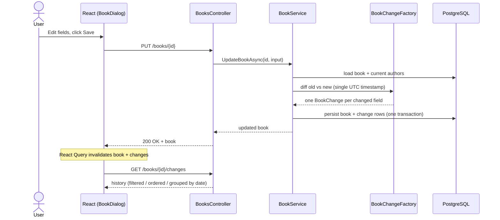

# Book Manager

A fullstack app to manage books and view each book's full **change history**, with
server-side pagination, filtering, ordering, and date-grouped history.

- **Backend** — ASP.NET Core (.NET 10) REST API, EF Core, documented with Swagger
- **Frontend** — React 19 + MUI (Vite + TypeScript)
- **Database** — PostgreSQL (via docker-compose)
- **Tests** — xUnit + Testcontainers (backend), Vitest + Testing Library (frontend), Playwright (e2e)

All pagination/filtering/ordering is executed **server-side in Postgres**. The current state of
each book lives in `Books`; every edit is diffed and written as one row per changed field into
`BookChanges`, with a precomputed human-readable sentence (e.g. `Title was changed to "The Hobbit"`).

## Architecture



### Change-log write flow (PUT)



---

## Prerequisites

| Tool | Version used | Notes |
|------|--------------|-------|
| .NET SDK | 10.x | `dotnet` must be on your `PATH` |
| Node.js | 20+ (tested on 24) | |
| Docker | with Compose v2 | for Postgres and backend Testcontainers |

> On macOS with Homebrew, .NET is keg-only. If `dotnet` is not found, add it to your shell:
> `export PATH="/opt/homebrew/opt/dotnet/bin:$PATH"`

---

## Project structure

```
.
├─ docker-compose.yml            # PostgreSQL
├─ scripts/run-e2e.sh            # one-shot: postgres + api + playwright
├─ backend/
│  ├─ src/BookManager.Api/       # API, EF entities, services, migrations, seeder
│  └─ tests/BookManager.Tests/   # xUnit: diff, describer, Testcontainers query tests
└─ frontend/
   ├─ src/                       # React app (api/, hooks/, components/)
   └─ e2e/                       # Playwright happy-path spec
```

---

## Running the app

### 1. Start PostgreSQL

```bash
docker compose up -d
```

Postgres listens on `localhost:5432` (db/user/password all `bookmanager`).

### 2. Start the API

```bash
cd backend
dotnet run --project src/BookManager.Api --launch-profile http
```

- API: <http://localhost:5021>
- Swagger UI: <http://localhost:5021/swagger>

On startup the API **applies migrations and seeds 200 sample books** (idempotent — only seeds an
empty database). Each seeded book gets a `Created` change row.

### 3. Start the frontend

```bash
cd frontend
npm install
npm run dev
```

App: <http://localhost:5173> (the frontend calls the API at `http://localhost:5021`; override with
`VITE_API_URL`).

---

## API endpoints

| Method | Route | Description |
|--------|-------|-------------|
| GET | `/books?page&pageSize&sort&dir&search` | Paged list; `search` is ILIKE over title + author name |
| GET | `/books/{id}` | Single book |
| POST | `/books` | Create (emits a `Created` change) |
| PUT | `/books/{id}` | Update (diffs old vs new, one change row per changed field) |
| GET | `/books/{id}/changes?page&pageSize&field&from&to&dir` | Change history (server-side filter/order/page) |
| GET | `/authors?search=` | Author search backing the autocomplete |

List responses use the envelope `{ items, totalCount, page, pageSize }`.

---

## Running the tests

### Backend (xUnit + Testcontainers)

Requires Docker running (the query tests spin up a throwaway Postgres container).

```bash
cd backend
dotnet test
```

Covers: PUT diff logic (one/many/no change rows, shared timestamp, author add/remove),
description-sentence generation, and the list/changes query logic (pagination, ILIKE filtering,
date-range filtering, ordering).

### Frontend unit (Vitest + Testing Library + MSW)

```bash
cd frontend
npm test
```

Covers: `BookList` (renders rows, paginates), `AuthorAutocomplete` (queries on input),
`ChangeHistory` (groups by date), `BookDialog` (form edits submit).

### End-to-end (Playwright)

Runs against the **real** stack. One-shot orchestration (starts Postgres + API, then runs the test):

```bash
# first time only: install the browser
cd frontend && npx playwright install chromium && cd ..

./scripts/run-e2e.sh
```

Or, with Postgres + API already running:

```bash
cd frontend
npx playwright test
```

The spec adds a book, confirms it in the list, renames the title, edits the description, asserts the
card reflects the new state, and asserts the change history shows the title- and description-change
entries.

---

## Notes / design decisions

- **Change log, not event sourcing.** Current state in `Books`; append-only history in `BookChanges`.
  One row per changed field; multiple fields edited in one save share a single UTC timestamp.
- **Authors** are supplied by name; the server find-or-creates them, so the autocomplete can pass an
  existing author or a brand-new typed name. The PUT diff compares author sets by name.
- **Grouping by date** is computed server-side onto each change row (`date`); since rows come back
  time-ordered, the timeline groups them deterministically without groups spanning a page boundary.
- **Loading states**: skeletons for known-shape content (book grid, change list); spinners for
  actions (author search, Save button).
